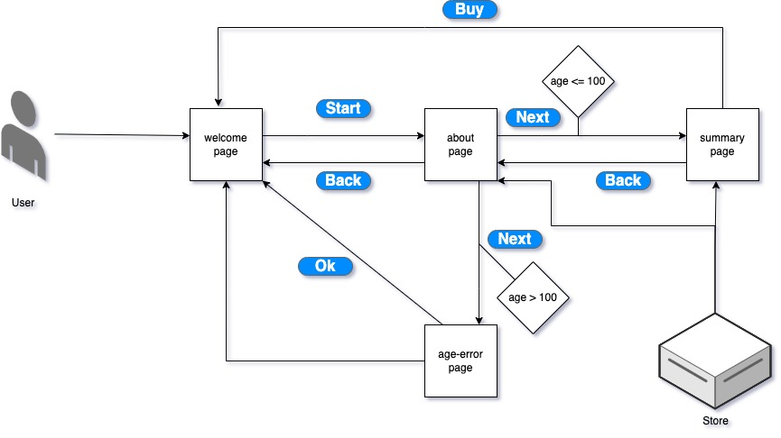

# Form Wizard

---

## Technical Choices

- I've used Vue 2 as I have previous experience working on it
- I've used Vue Router to navigate between pages
- I've used Vuex to store and retrieve data throughout the application
- I've used tailwindcss for styling the UI
- I've used Eslint and prettier for linting and formatting the code

## Architecture

## Approach

- I used the Vue CLI tool to initialize and create a new Vue project and also add a Github repository
- Vue CLI was also used to add plugins mentioned below
- Once the basic project structure was ready, I then created empty pages component like Welcome, About, etc.
- After that using the wireframes provided I created the UI and UX for every individual page

## Plugins

| Plugin      |
| ----------- |
| Vuex        |
| Vue Router  |
| Eslint      |
| Prettier    |
| Tailwindcss |
